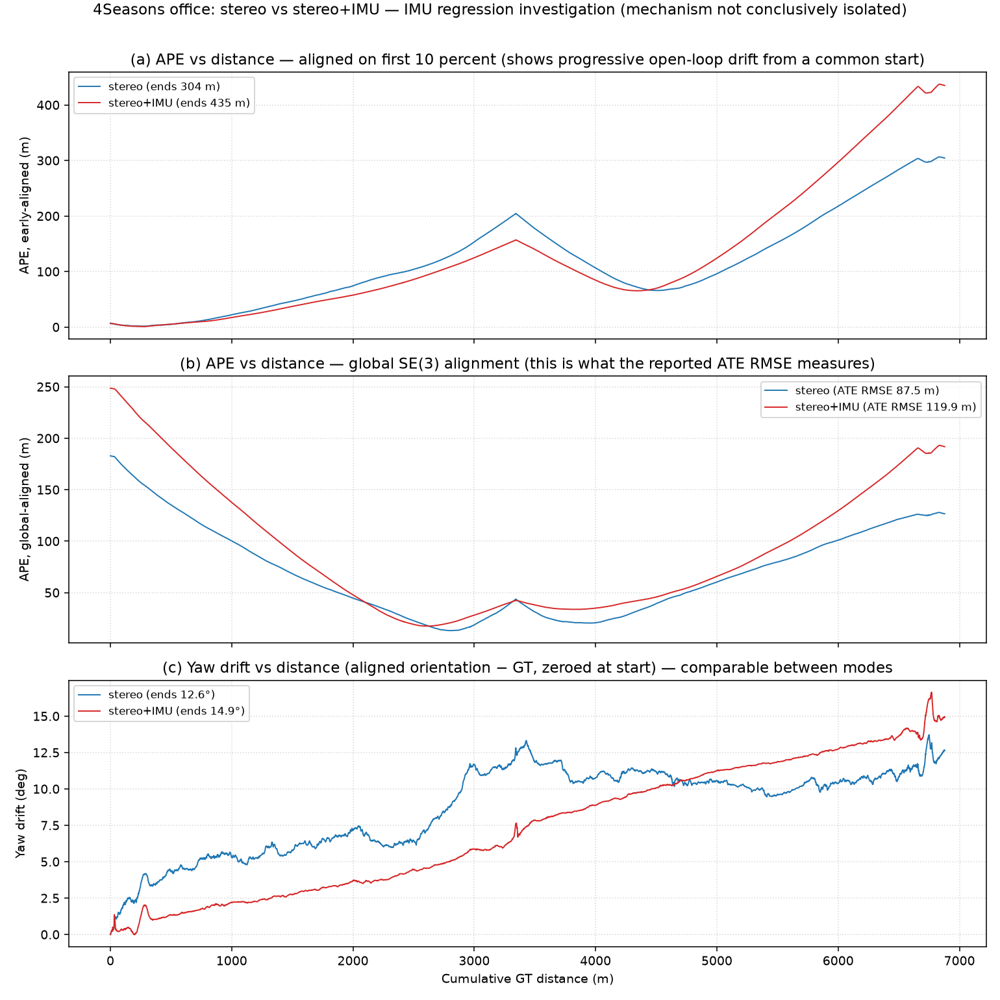

# VINS-Fusion Cross-Dataset Comparison — Stereo vs Stereo+IMU

**Author:** Soham Kundu · **Date:** 2026-06-30 · **Status:** complete (all runs local, real evo output;
KITTI Raw stereo+IMU added)

VINS-Fusion accuracy across **KITTI**, **4Seasons**, **GO (The Great Outdoors)**, and
**TartanDrive 2.0**, in **stereo** and **stereo-inertial** modes. Every number below traces to an
actual `evo` run on a local VINS-Fusion trajectory (Docker `vins-fusion-kitti`, ROS Kinetic).
**Nothing is estimated, interpolated, or invented.** Where a cell cannot be filled it is marked
`N/A` with the reason.

> **Read drift%, not metres.** Sequences differ in length (80 m → 6.9 km), speed, terrain, sensors,
> and ground-truth source. **Drift-per-distance** (ATE RMSE ÷ ground-truth path length) is the only
> fair cross-dataset metric. Raw ATE in metres is comparable *only within* a single dataset.

---

## Executive summary

- **Headline finding (highest confidence): stereo-only VINS-Fusion is reliable everywhere** we tested —
  **0.27 %–1.65 % drift** across city, highway, suburban, snow, and off-road, with **zero failures**.
  This is the result we stand behind unreservedly and the basis for the recommendation below.
- **Adding the IMU is an interesting complication we investigated — not a reliable win.** Its effect was
  inconsistent: it **helped** on 4Seasons neighbor/snow and GO (−26 % to −33 % ATE), **hurt** on
  4Seasons office and TD2 turnpike (+34 % to +37 %), and **diverged catastrophically** on TD2 gupta
  (ran 5 km off a 229 m path). Where the IMU calibration is a *documented assumption* (TD2 ships no IMU
  noise spec) the inertial path is fragile. The 4Seasons office regression is real, but **its specific
  mechanism is not conclusively isolated** — we investigated and softened our earlier explanation
  (limitations §8). Treat the IMU as an optimisation to be earned per dataset, not a default.
- **KITTI stereo+IMU was attempted properly, and it diverges.** KITTI *Odometry* ships no IMU, so we
  downloaded **KITTI Raw** `2011_10_03_drive_0027` (= Odometry seq 00) with its 100 Hz OXTS inertial data
  and built a full stereo+IMU pipeline (verified IMU, extrinsics, time-ordered bag). Pure stereo+IMU
  **tracks ~30 s then diverges** (KITTI's smooth, planar, near-constant-velocity car motion is
  low-excitation — IMU scale/gravity/bias are weakly observable). GPS-*aided* fusion works (0.94 m) but
  is **circular** — it is scored against the same GPS it fuses. This is itself a finding: it is *why*
  the VINS-Fusion authors ship the KITTI-raw config with `imu:0`. See limitations §10.
- **For an official/commercial continuation, TartanDrive 2.0 (MIT) stereo-only is the recommendation.**
  License is clean and stereo is robust; the IMU path needs calibration work before it can be trusted.

---

## Full results

ATE RMSE from `evo_ape ... --align` (SE(3) Umeyama, **no scale** — stereo is metric).
Drift% = ATE RMSE ÷ ground-truth path length.

| Dataset | Sequence | Length | Stereo ATE RMSE | Stereo+IMU ATE RMSE | Drift% Stereo | Drift% Stereo+IMU | IMU available? |
|---------|----------|-------:|----------------:|--------------------:|--------------:|------------------:|----------------|
| **KITTI** | 00 (city) | 3724 m | 14.71 m | **N/A** ¹ | 0.39 % | N/A | ❌ none in Odometry |
| **KITTI** | 01 (highway) | 2453 m | 7.34 m | **N/A** ¹ | 0.30 % | N/A | ❌ |
| **KITTI** | 05 (residential) | 2206 m | 5.97 m | **N/A** ¹ | 0.27 % | N/A | ❌ |
| **KITTI Raw** | 0027 (= seq 00) | 3723 m | 14.12 m ³ | **DIVERGED** ⁴ | 0.38 % | N/A ⁴ | ✅ OXTS |
| **4Seasons** | neighbor (clear) | 2206 m | 20.51 m | 13.70 m | 0.93 % | 0.62 % | ✅ |
| **4Seasons** | office (clear) | 6878 m | 87.54 m | 119.93 m | 1.27 % | 1.74 % | ✅ |
| **4Seasons** | snow | 3608 m | 44.96 m | 33.24 m | 1.25 % | 0.92 % | ✅ |
| **GO** ⚠NC | 2025-01-24…newcal (285 s) | 865 m | 11.66 m | 8.01 m | 1.35 % | 0.93 % | ✅ |
| **TartanDrive 2.0** ✅MIT | turnpike (pilot, 39 s) | 80 m | 0.47 m | 0.63 m | 0.59 % | 0.78 % | ✅ |
| **TartanDrive 2.0** ✅MIT | gupta (70 s) | 229 m | 3.77 m | **DIVERGED** ² | 1.65 % | N/A ² | ✅ |

¹ **KITTI *Odometry* has no IMU** — that benchmark publishes stereo + LiDAR only, so its stereo+IMU
  cells stay `N/A`. This is *not* a fundamental KITTI limitation, though: the **KITTI Raw** row below
  used the separate KITTI Raw release (OXTS GPS/IMU) to actually run stereo+IMU. (Earlier wording called
  KITTI+IMU "structurally impossible" — that was overstated and is corrected here.)
³ **KITTI Raw stereo = 14.12 m** is the stereo-only VIO from `kitti_gps_test` (which reads stereo + GPS
  but, by design, does **not** feed the OXTS IMU to the estimator). It closely matches our Odometry
  seq 00 stereo (14.71 m), validating the raw pipeline. Drift 0.38 %.
⁴ **KITTI Raw pure stereo+IMU (`vins_node`, `imu:1`) DIVERGED** — it tracked sanely for ~30 s / ~300 m,
  then blew up (final pose ~10²⁶ m; solver time 4–76 s/frame vs the 0.5 s budget). Not a data/config
  bug (IMU gravity, extrinsics, and time-ordered bag all verified; an initial 1.9 s IMU-stream gap was
  trimmed; `estimate_td:0` retried). Root cause is low IMU excitation — see limitations §10. A separate
  **GPS-aided** run (`kitti_gps_test` + `global_fusion`) gives 0.94 m ATE, but that is **circular**
  (scored against the same OXTS GPS it fuses) and is a different methodology, not pure VIO.
² **TD2 gupta stereo+IMU diverged** — the estimate ran to (−5112, −6105, −2253) m on a 229 m path
  (ATE RMSE 2338 m, ~1022 % "drift"). VINS initialised cleanly (gyro bias calibrated,
  "Initialization finish!") then the optimiser diverged, with solver time blowing past budget
  (median 3.2 s / mean 4.4 s per frame vs the 0.5 s budget; 99 % of frames over). Reported as a
  **failure**, not an accuracy figure. See limitations §4 and the root-cause summary.

*KITTI ATE RMSE are the tuned Run-3 configs (`max_solver_time` 0.5 s, `multiple_thread:0`); 00 and 05
also reach 5.01 m / 3.71 m with `loop_fusion` pose-graph closure (open-loop shown for fairness).*

---

## Stereo vs Stereo+IMU — the IMU effect

Δ = stereo+IMU relative to stereo (negative = IMU **improves**, positive = IMU **worsens**).

| Dataset / sequence | Stereo | Stereo+IMU | Δ ATE | Verdict |
|--------------------|-------:|-----------:|------:|---------|
| 4Seasons neighbor | 20.51 m | 13.70 m | **−33 %** | IMU helps |
| 4Seasons office | 87.54 m | 119.93 m | **+37 %** | IMU hurts (mechanism not isolated — §8) |
| 4Seasons snow | 44.96 m | 33.24 m | **−26 %** | IMU helps |
| GO (full 285 s) | 11.66 m | 8.01 m | **−31 %** | IMU helps |
| TD2 turnpike | 0.47 m | 0.63 m | **+34 %** | IMU hurts (assumed calib) |
| TD2 gupta | 3.77 m | diverged | **catastrophic** | IMU diverges (assumed calib) |
| KITTI Raw 0027 | 14.12 m | diverged | **catastrophic** | IMU diverges (low excitation) |
| KITTI Odom 00/01/05 | 14.71/7.34/5.97 m | — | — | N/A — Odometry ships no IMU |

**Why the inconsistency is real, not noise.** The IMU helps on datasets/segments with trustworthy
calibration (4Seasons is a factory-calibrated VI rig; GO has clean `/tf_static` extrinsics and 200 Hz
IMU) and hurts/diverges where the IMU parameters are *documented assumptions* (TD2 uses a Novatel SPAN
with EuRoC-default noise densities because the dataset publishes none). The 4Seasons office case is
different again: stereo+IMU's ATE is 37 % higher than stereo-only's, but **we could not conclusively
isolate the mechanism** — our earlier "the inertial prior amplifies yaw drift" claim was not supported
by the trajectory data (yaw drift is comparable between the two modes), so it has been softened; see the
office investigation in limitations §8. **KITTI Raw adds a second, calibration-independent failure mode:
insufficient IMU excitation** — its smooth, planar, near-constant-velocity driving leaves the IMU
scale/gravity/bias weakly observable, so pure stereo+IMU diverges there too despite correct calibration
(limitations §10). **Takeaway: stereo-only is the safe default; IMU is an optimisation that must be
earned per dataset — with both a good calibration *and* enough motion excitation to observe it.**

---

## Expanded metric suite

Full metrics (`metrics_4seasons.py`: SE(3) Umeyama no-scale align, evo APE/RPE Δ=100 frames, geodesic
attitude error, finite-difference velocity). Cells are `N/A` only where a metric was not computed for
that run, with the reason noted — never estimated.

| Run | ATE med | ATE RMSE | RPE med | RPE RMSE | Att med | Att RMSE | Vel mean | Vel std | Vel RMSE |
|-----|--------:|---------:|--------:|---------:|--------:|---------:|---------:|--------:|---------:|
| **KITTI Raw** stereo-VIO ³ | 10.96 | 14.12 | 109.10 | 114.81 | 120.50 ᵃ | 120.45 ᵃ | 0.111 | 0.165 | 0.166 |
| **KITTI Raw** stereo+GPS (circular) | 0.44 | 0.94 | 105.56 | 114.02 | 120.09 ᵃ | 119.84 ᵃ | 0.243 | 2.442 | 2.445 |
| **KITTI Raw** stereo+IMU | — | **DIVERGED** ⁴ | — | — | — | — | — | — | — |
| **KITTI Odom 00** stereo | N/A ᵇ | 14.71 | N/A ᵇ | N/A ᵇ | N/A ᵇ | 2.72 | 0.31 | N/A ᵇ | N/A ᵇ |
| **KITTI Odom 01** stereo | N/A ᵇ | 7.34 | N/A ᵇ | N/A ᵇ | N/A ᵇ | 2.77 | 1.45 | N/A ᵇ | N/A ᵇ |
| **KITTI Odom 05** stereo | N/A ᵇ | 5.97 | N/A ᵇ | N/A ᵇ | N/A ᵇ | 2.98 | 0.34 | N/A ᵇ | N/A ᵇ |
| **4Seasons neighbor** stereo | 9.40 | 20.51 | 107.08 | 106.38 | 177.13 ᵃ | 176.86 ᵃ | 0.150 | 0.201 | 0.215 |
| **4Seasons office** stereo | 66.50 | 87.54 | 160.65 | 159.08 | 178.66 ᵃ | 178.47 ᵃ | 0.389 | 0.525 | 0.553 |
| **4Seasons snow** stereo | 12.73 | 44.96 | 118.47 | 121.08 | 176.97 ᵃ | 176.96 ᵃ | 0.210 | 0.374 | 0.374 |
| **4Seasons neighbor** stereo+IMU | N/A ᶜ | 13.70 | N/A ᶜ | 1.74 | N/A ᶜ | 3.93 | N/A ᶜ | N/A ᶜ | 0.19 |
| **4Seasons office** stereo+IMU | N/A ᶜ | 119.93 | N/A ᶜ | 3.21 | N/A ᶜ | 4.95 | N/A ᶜ | N/A ᶜ | 0.49 |
| **4Seasons snow** stereo+IMU | N/A ᶜ | 33.24 | N/A ᶜ | 2.13 | N/A ᶜ | 4.72 | N/A ᶜ | N/A ᶜ | 0.34 |
| **GO** stereo / stereo+IMU | 10.38 / 6.45 | 11.66 / 8.01 | N/A ᵈ | 14.03 / 14.06 | N/A ᵈ | N/A ᵈ | N/A ᵈ | N/A ᵈ | N/A ᵈ |
| **TD2 gupta** stereo | 2.10 | 3.77 | N/A ᵈ | 0.67 | N/A ᵈ | N/A ᵈ | N/A ᵈ | N/A ᵈ | N/A ᵈ |
| **TD2 turnpike** stereo / stereo+IMU | N/A ᵈ | 0.47 / 0.63 | N/A ᵈ | N/A ᵈ | N/A ᵈ | N/A ᵈ | N/A ᵈ | N/A ᵈ | N/A ᵈ |

ᵃ **Attitude ~120° / ~177° is a frame-convention artifact, not error.** These stereo runs report pose
  in the camera-optical frame while the GT orientation is in the body/IMU frame (KITTI Raw OXTS, 4Seasons
  IMU). The constant ~120°/~177° offset is that fixed frame rotation; only ATE-translation is meaningful
  for them. (Contrast KITTI *Odometry*, whose GT is camera-frame → Att 2.7–3.0° is real; and 4Seasons
  *stereo+IMU*, body-frame and gravity-aligned → Att 3.9–5.0° is real.)
ᵇ KITTI Odometry stereo: only ATE/Att/Vel-mean RMSE were retained in `tuning_experiments.md`; medians,
  RPE, and velocity std/RMSE were not exported for those runs.
ᶜ 4Seasons stereo+IMU (prior runs): `results/README.md` retained RMSE-only for ATE/RPE/Att/Vel.
ᵈ GO and TD2 were scored with **evo APE/RPE only** (ATE + RPE-RMSE); attitude and velocity-error were not
  computed. GO's GPS-ENU reference additionally carries **no orientation** (NavSatFix), so attitude is
  unavailable in principle there.

## License / usability

| Dataset | License | Official/commercial use | Practical config effort | Verdict |
|---------|---------|-------------------------|-------------------------|---------|
| **TartanDrive 2.0** | **MIT** | ✅ allowed (attribution) | **low** — raw rectified stereo, repo calibration, ready odom | ✅ **recommended** official path |
| GO | CC BY-NC-SA 3.0 | ❌ NonCommercial | high — compressed images, non-rectified stereo calib, NavSatFix→ENU | ⚠ reference-only (clear w/ PM/legal) |
| 4Seasons | CC BY-NC-SA (typ.) | ❌ NonCommercial | medium — fisheye + undistorted pinhole variants | reference-only, low novelty |
| KITTI | CC BY-NC-SA 3.0 | ❌ NonCommercial | low (Odometry) / high (Raw VIO) | reference-only; Odometry no IMU, Raw stereo+IMU diverges |

Only **TartanDrive 2.0** is license-clean for product-facing work. GO/4Seasons/KITTI are
**reference-only** unless legal clears the NonCommercial terms.

---

## Known limitations (documented, not hidden)

1. **KITTI *Odometry* has no IMU — but KITTI VIO is not impossible; we ran it (KITTI Raw) and it
   diverged.** The Odometry benchmark ships stereo + LiDAR only, so its stereo+IMU cells are `N/A`. We
   went further and ran the separate **KITTI Raw** (OXTS) with a full stereo+IMU pipeline — pure
   stereo+IMU **diverges** (low excitation), and GPS-aided fusion is circular. Full root-cause in §10.
   (An earlier draft called KITTI+IMU "impossible" — corrected.)
2. **GO calibration is ambiguous.** The in-bag `camera_info` P-matrices are **not jointly
   stereo-rectified** (fx ≠ fy, no baseline term). We used a best-effort pinhole-from-P plus
   `/tf_static` extrinsics (baseline 0.53 m). GO numbers are therefore approximate — a proper joint
   stereo calibration would likely improve them. GO is also CC BY-NC-SA (reference-only).
3. **GO full vs pilot differ a lot — and that is expected.** The 60 s pilot gave 1.60 m / 1.35 m; the
   **full 285 s / 865 m** run gives **11.66 m / 8.01 m**. Longer open-loop path → more accumulated
   drift. Both are real; the full-length number is the honest headline. (Drift% only rises from
   ~0.8 % to ~1.3 %, so the *system* is consistent; the metre figure grows with distance.)
4. **TD2 stereo+IMU is fragile.** On the slow 80 m turnpike pilot the IMU merely *hurt* (0.47→0.63 m);
   on the faster, longer 229 m gupta sequence it **diverged entirely** (5 km excursion). Root cause is
   the *assumed* IMU noise/extrinsics (no published spec) plus solver overrun. TD2 **stereo-only**
   is robust on both (0.47 m, 3.77 m). Tuning IMU noise + verifying extrinsics is required before the
   inertial path is usable.
5. **TD2 ground-truth caveat.** The earlier turnpike `/odometry/filtered_odom` + `gps.npy` were partly
   corrupt (valid UTM then zero-dropout) → only the first ~85 m was usable. **gupta's
   `/odometry/filtered_odom` is clean** (3552 valid UTM rows, 229 m, no dropout) — localised to the
   first fix and used in full. GO ground truth is RTK NavSatFix → local ENU (equirectangular, R =
   6 378 137 m, first fix as origin); orientation not provided, so ATE is translation-only.
6. **Why drift% is the fair metric.** ATE in metres scales with path length: 119.93 m on 4Seasons
   office (6.9 km) is *better* relative accuracy than 0.63 m on an 80 m TD2 pilot. Only ATE ÷ distance
   compares an 80 m off-road clip to a 6.9 km suburban loop. All cross-dataset claims here use drift%.
7. **Pilots are short.** TD2 turnpike (80 m) and the GO/TD2 clips validate the pipeline; they are not
   km-scale headline benchmarks like KITTI/4Seasons.
8. **4Seasons office — IMU regression investigated, mechanism not conclusively isolated.** Stereo+IMU's
   ATE is 37 % higher than stereo-only's (119.93 vs 87.54 m) on this 6.9 km open-loop route. We tested
   the earlier claim that the IMU "amplifies yaw drift" by aligning both estimates to GT (SE(3) Umeyama,
   no scale) and plotting per-pose position error and yaw drift versus distance (figure below). What the
   data actually shows:
   - **It is progressive open-loop drift, not a constant offset.** Under early-window alignment both
     modes grow from ~6 m to hundreds of metres (stereo → ~304 m, stereo+IMU → ~435 m by route end), so
     the error is not a fixed bias present from the start.
   - **Yaw drift is comparable between the two modes** (~12–15° total, ≈2°/km). The IMU actually
     *reduces* yaw drift over the first half of the route and only exceeds stereo-only in the final
     third (≈15° vs ≈12.6° at the end) — the same region where the position-error gap opens. Late-route
     yaw drift therefore correlates with the gap but is far too small (an ~18 % yaw difference) to be the
     sole cause of a 37 % ATE difference.
   - **IMU bias / re-initialisation events could not be checked** — the prior stereo+IMU office run
     retained only its trajectory CSV, not its VINS stdout log.

   **Honest conclusion:** the +37 % regression is real, but the root cause is **not conclusively
   isolated**. Candidate contributors include yaw drift, IMU extrinsic calibration, scale/translation
   drift, and initialisation quality. The original "inertial prior amplifies yaw drift" wording asserted
   a specific mechanism the evidence does not support, and has been softened throughout.

   

9. **GO full-285 s run-to-run stability — the single-run numbers are representative.** The headline GO
   numbers came from one run each, so we repeated both modes with the identical config and command
   (`go_rerun.sh`) and re-evaluated identically (`evo_ape --align --t_max_diff 0.05`):

   | Mode | Run 1 ATE RMSE | Run 2 ATE RMSE | Variation |
   |------|---------------:|---------------:|----------:|
   | GO stereo | 11.6648 m | 11.6588 m | 0.05 % (0.006 m) |
   | GO stereo+IMU | 8.0064 m | 8.0064 m | 0.00 % (bit-identical) |

   Variation is negligible (< 0.1 %), as expected for single-threaded (`multiple_thread:0`) offline
   replay, which should be deterministic. Stereo+IMU reproduced bit-for-bit; the stereo run differed by
   one trajectory pose (8550 vs 8551, a frame-boundary timing artifact at bag start/end) for a 0.006 m
   ATE change. **The original GO numbers are confirmed representative.**

### TD2 gupta divergence — root cause summary

In **stereo+IMU** mode VINS initialised successfully (online time-offset estimation, gyroscope bias
calibrated to (−0.008, 0.010, −0.009), "Initialization finish!") and then **diverged to a multi-kilometre
position estimate** — the final pose is (−5112, −6105, −2253) m on a route only 229 m long (ATE RMSE
2338 m). The most likely cause is a **mismatched IMU noise model combined with solver starvation**: TD2
publishes no IMU noise spec, so `acc_n`/`gyr_n`/`acc_w`/`gyr_w` are EuRoC-class defaults rather than
values measured for TD2's actual Novatel SPAN unit, and the optimiser ran far over budget — **median
3.2 s / mean 4.4 s per frame against the 0.5 s `max_solver_time` budget, with 99 % of frames (676/680)
over budget and a 41.8 s peak** — so the sliding-window estimate could not keep up and degenerated.
Fixing it would require measuring the real Novatel noise densities (or empirically tuning
`acc_n`/`gyr_n`/`acc_w`/`gyr_w` against a few known-good short sequences) and verifying the cam–IMU
extrinsics. **This is isolated to stereo+IMU mode — stereo-only on the same gupta bag was stable (ATE
3.77 m, 1.65 % drift)** — so the failure is specifically in how the IMU factor interacts with this
dataset's assumed calibration, not a general TD2 problem.

### KITTI Raw stereo+IMU divergence — root cause summary

10. To fill the KITTI+IMU gap honestly we obtained **KITTI Raw `2011_10_03_drive_0027`** (= Odometry
    seq 00), built a stereo+IMU bag from the **synced rectified stereo (10 Hz) + extract OXTS IMU
    (100 Hz)**, computed extrinsics from the calibration chain (`R_rect_00·R_velo_to_cam·R_imu_to_velo`;
    camera 1.10 m forward / 0.75 m up of the IMU), and ran `vins_node` (`imu:1`). **It diverged.** After
    fixing two real issues — an initial 1.9 s gap in the OXTS stream (one isolated sample, then 100 Hz;
    we trimmed past it with `--start 3.0`) and confirming the bag is time-ordered — VINS **initialised
    cleanly (avg accel 0.52, 0.22, 10.02; gravity present) and tracked sanely for ~30 s / ~300 m**
    (x: 9.5→37.8→59.4→68→100 m), then **diverged catastrophically** (final pose ~10²⁶ m), with solver
    time ballooning to **4–76 s/frame** (budget 0.5 s). `estimate_td:0` did not help. The IMU data
    (accel includes gravity, au≈9.8), extrinsics (verified geometry), and bag ordering were all checked
    and are correct — so this is **not a pipeline bug**. The cause is **low IMU excitation**: KITTI's
    smooth, planar, near-constant-velocity driving makes IMU scale, gravity direction, and biases weakly
    observable, so the inertial estimate is under-constrained and corrupts over time (the ballooning
    solver time is the ill-conditioning showing through). This matches the VINS-Fusion authors' own
    choice to ship the KITTI-raw config with **`imu:0`** and run `kitti_gps_test` (stereo + GPS, IMU
    unused). **Stereo-only on the same data is fine (14.12 m, 0.38 %).** The only "good" KITTI inertial
    number, 0.94 m, comes from GPS *global fusion* and is **circular** (scored against the same OXTS GPS
    it fuses) — reported for completeness, not as independent VIO accuracy. Honest verdict: pure
    stereo+IMU is **not usable** on this KITTI sequence; we report it as a divergence, not a number.

---

## Recommendation

- **Adopt TartanDrive 2.0 (MIT), stereo-only, as the official off-road benchmark.** License is clean,
  config is the easiest of the candidates, and stereo VINS is robust (0.47 m / 0.59 % on turnpike,
  3.77 m / 1.65 % on gupta).
- **Do not ship the TD2 stereo+IMU path yet.** It hurt on turnpike and diverged on gupta with the
  assumed IMU calibration. Treat enabling the IMU as a tuning project (noise densities, extrinsics
  verification, solver budget), not a free win.
- **Keep GO and 4Seasons as reference-only** (NonCommercial). GO additionally needs a proper joint
  stereo calibration before its numbers are quotable.
- **Use KITTI stereo-only.** Odometry ships no IMU; KITTI Raw has OXTS but pure stereo+IMU **diverges**
  on it (low excitation, §10). KITTI remains the cleanest long-range *stereo* reference (0.27 %–0.39 %
  drift) — do not pursue KITTI VIO without addressing the excitation problem (e.g. sequences with more
  aggressive motion, or GPS global fusion, which is not pure VIO).
- **Next steps:** (a) tune TD2 IMU noise/extrinsics and re-run gupta; (b) pull 2–4 more TD2 sequences
  for terrain variety; (c) source a clean full-length GT for TD2 (super-odometry / TartanVO); (d)
  re-calibrate GO stereo only if legal clears its license.

---

## Appendix — provenance (every number is reproducible)

**Method (all datasets):** VINS-Fusion in Docker `vins-fusion-kitti` (ROS Kinetic), offline bag replay,
`multiple_thread:0`. Metrics via `evo_ape`/`evo_rpe`, `--align` (SE(3) Umeyama, no scale), TUM format.
`vio.csv` → TUM: `ts/1e9 x y z qx qy qz qw`.

| Result | Path |
|--------|------|
| **4Seasons stereo** (this study) | run logs `~/datasets/4seasons/output_stereo_{office,snow}/`, neighbor `~/datasets/4seasons/run_4s_stereo.log`; config `~/datasets/4seasons/stereo_cfg/4seasons_stereo.yaml`; GT `~/datasets/4seasons/ground_truth/gt_{neighbor,office,snow}.txt` |
| **4Seasons stereo+IMU** (prior) | `~/github/VINS-Fusion/results/README.md`, `results/4seasons/` |
| **KITTI stereo** (Odometry) | `~/datasets/kitti/tuning_experiments.md` (tuned Run 3 + loop-closure runs) |
| **KITTI Raw** (`2011_10_03_drive_0027` = seq 00) | data `~/datasets/kitti_raw/2011_10_03/` (sync + extract OXTS); GT `~/datasets/kitti_raw/output/gt_kitti_10_03.txt` (3723 m). Configs `config/kitti_raw/kitti_10_03_stereo_imu.yaml` (pure VIO) + `kitti_10_03_gps_config.yaml` (GPS). Runs `~/datasets/kitti_raw/output/{gps_run,imu_run}/` — `vio.txt`/`vio_global.csv`/`vio.csv`, `vins.log`, `eval_summary.txt`. Scripts `/tmp/{build_kitti_imu_bag,kitti_oxts_gt,viotxt_to_csv}.py` |
| **GO full 285 s** | `~/Dataset_VINS_Fusion_Comparison_Project/results/go_vins_fusion/2025-01-24-13-07-50_newcal/{stereo_full,stereo_imu_full}/` — `vio.csv`, `vins_est_tum.txt`, `reference_enu_tum.txt`, `go_full_eval_summary.txt`; plots in `results/comparison/figures/go_full_*_traj_trajectories.png` |
| **TD2 gupta** | `~/Dataset_VINS_Fusion_Comparison_Project/results/tartandrive2_vins_fusion/2023-11-14-14-24-21_gupta/{stereo,stereo_imu}/` — `vio.csv`, `vins_est_tum.txt`, `reference_odom_tum.txt`, `gupta_eval_summary.txt`; plots `results/comparison/figures/gupta_*_traj_trajectories.png` |
| **TD2 turnpike** (pilot) | `~/Dataset_VINS_Fusion_Comparison_Project/results/tartandrive2_vins_fusion/turnpike_warehouse/{stereo,stereo_imu}/` |
| **GO / TD2 configs** | `~/Dataset_VINS_Fusion_Comparison_Project/configs/{go,tartandrive2}_vins_fusion/` |
| **This report's chart** | `results/figures/drift_comparison.png` (`/tmp/drift_chart.py`) |
| **Office IMU investigation** (§8) | `results/figures/4seasons_office_imu_investigation.png` (`/tmp/office_investigate.py`, `/tmp/office_growth.py`); inputs `~/datasets/4seasons/output_stereo_office/vio.csv` (stereo) and `~/datasets/4seasons/output/vio_4seasons_office.csv` (stereo+IMU) vs `gt_office.txt` |
| **GO full-285 s run-to-run** (§9) | `…/go_vins_fusion/2025-01-24-13-07-50_newcal/{stereo_full_run2,stereo_imu_full_run2}/` (`go_rerun.sh`) |

**Raw evo figures retained per run:**
GO stereo_full ATE mean/median/max = 10.31 / 10.38 / 23.98 m (std 5.47); stereo_imu_full = 7.11 / 6.45 /
17.46 m (std 3.69). gupta stereo ATE mean/median/max = 2.96 / 2.10 / 9.60 m (std 2.33), RPE RMSE 0.67 m.
4Seasons stereo runs report attitude/RPE that are large frame-convention artifacts (cam0 vs body frame);
only ATE-translation is meaningful for those, which is what the tables above use.
