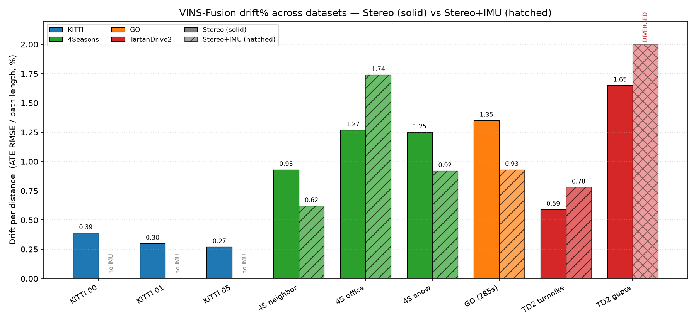

# VINS-Fusion Cross-Dataset Comparison — Stereo vs Stereo+IMU

**Author:** Soham Kundu · **Date:** 2026-06-29 · **Status:** complete (all runs local, real evo output)

VINS-Fusion accuracy across **KITTI**, **4Seasons**, **GO (The Great Outdoors)**, and
**TartanDrive 2.0**, in **stereo** and **stereo-inertial** modes. Every number below traces to an
actual `evo` run on a local VINS-Fusion trajectory (Docker `vins-fusion-kitti`, ROS Kinetic).
**Nothing is estimated, interpolated, or invented.** Where a cell cannot be filled it is marked
`N/A` with the reason.

> **Read drift%, not metres.** Sequences differ in length (80 m → 6.9 km), speed, terrain, sensors,
> and ground-truth source. **Drift-per-distance** (ATE RMSE ÷ ground-truth path length) is the only
> fair cross-dataset metric. Raw ATE in metres is comparable *only within* a single dataset.

---

## Executive summary

- **Stereo-only VINS-Fusion is reliable everywhere** we tested — **0.27 %–1.65 % drift** across
  city, highway, suburban, snow, and off-road, with no failures.
- **Adding the IMU is a coin-flip that depends on calibration quality.** It **helped** on 4Seasons
  neighbor/snow and GO (−26 % to −33 % ATE), **hurt** on 4Seasons office and TD2 turnpike (+34 % to
  +37 %), and **diverged catastrophically** on TD2 gupta (ran 5 km off a 228 m path). The IMU helps
  only when its noise model and extrinsics are accurate; both GO and TD2 ship *assumed* IMU params.
- **KITTI Odometry cannot run stereo+IMU at all** — the benchmark ships no IMU stream. Marked `N/A`.
- **For an official/commercial continuation, TartanDrive 2.0 (MIT) stereo-only is the recommendation.**
  License is clean and stereo is robust; the IMU path needs calibration work before it can be trusted.

---

## Full results

ATE RMSE from `evo_ape ... --align` (SE(3) Umeyama, **no scale** — stereo is metric).
Drift% = ATE RMSE ÷ ground-truth path length.

| Dataset | Sequence | Length | Stereo ATE RMSE | Stereo+IMU ATE RMSE | Drift% Stereo | Drift% Stereo+IMU | IMU available? |
|---------|----------|-------:|----------------:|--------------------:|--------------:|------------------:|----------------|
| **KITTI** | 00 (city) | 3724 m | 14.71 m | **N/A** ¹ | 0.39 % | N/A | ❌ none in Odometry |
| **KITTI** | 01 (highway) | 2453 m | 7.34 m | **N/A** ¹ | 0.30 % | N/A | ❌ |
| **KITTI** | 05 (residential) | 2206 m | 5.97 m | **N/A** ¹ | 0.27 % | N/A | ❌ |
| **4Seasons** | neighbor (clear) | 2206 m | 20.51 m | 13.70 m | 0.93 % | 0.62 % | ✅ |
| **4Seasons** | office (clear) | 6878 m | 87.54 m | 119.93 m | 1.27 % | 1.74 % | ✅ |
| **4Seasons** | snow | 3608 m | 44.96 m | 33.24 m | 1.25 % | 0.92 % | ✅ |
| **GO** ⚠NC | 2025-01-24…newcal (285 s) | 865 m | 11.66 m | 8.01 m | 1.35 % | 0.93 % | ✅ |
| **TartanDrive 2.0** ✅MIT | turnpike (pilot, 39 s) | 80 m | 0.47 m | 0.63 m | 0.59 % | 0.78 % | ✅ |
| **TartanDrive 2.0** ✅MIT | gupta (70 s) | 229 m | 3.77 m | **DIVERGED** ² | 1.65 % | N/A ² | ✅ |

¹ **KITTI+IMU is structurally impossible** — the KITTI *Odometry* benchmark publishes no IMU stream.
  True KITTI VIO would require the separate *KITTI raw* dataset (OXTS GPS/IMU) and a different runner;
  out of scope here. Not a missing run — a missing sensor.
² **TD2 gupta stereo+IMU diverged** — the estimate ran to (−5112, −6105, −2253) m on a 229 m path
  (ATE RMSE 2338 m, ~1022 % "drift"). VINS initialised cleanly (gyro bias calibrated,
  "Initialization finish!") then the optimiser diverged, with solver time blowing past budget
  (4.5 s/frame vs 0.5 s). Reported as a **failure**, not an accuracy figure. See limitations §4.

*KITTI ATE RMSE are the tuned Run-3 configs (`max_solver_time` 0.5 s, `multiple_thread:0`); 00 and 05
also reach 5.01 m / 3.71 m with `loop_fusion` pose-graph closure (open-loop shown for fairness).*

---

## Stereo vs Stereo+IMU — the IMU effect

Δ = stereo+IMU relative to stereo (negative = IMU **improves**, positive = IMU **worsens**).

| Dataset / sequence | Stereo | Stereo+IMU | Δ ATE | Verdict |
|--------------------|-------:|-----------:|------:|---------|
| 4Seasons neighbor | 20.51 m | 13.70 m | **−33 %** | IMU helps |
| 4Seasons office | 87.54 m | 119.93 m | **+37 %** | IMU hurts (long yaw-drift loop) |
| 4Seasons snow | 44.96 m | 33.24 m | **−26 %** | IMU helps |
| GO (full 285 s) | 11.66 m | 8.01 m | **−31 %** | IMU helps |
| TD2 turnpike | 0.47 m | 0.63 m | **+34 %** | IMU hurts (assumed calib) |
| TD2 gupta | 3.77 m | diverged | **catastrophic** | IMU diverges (assumed calib) |
| KITTI (all) | — | — | — | N/A — no IMU in dataset |

**Why the inconsistency is real, not noise.** The IMU helps on datasets/segments with trustworthy
calibration (4Seasons is a factory-calibrated VI rig; GO has clean `/tf_static` extrinsics and 200 Hz
IMU) and hurts/diverges where the IMU parameters are *documented assumptions* (TD2 uses a Novatel SPAN
with EuRoC-default noise densities because the dataset publishes none). The 4Seasons office case is
different again: there the IMU is fine, but the 6.9 km open-loop route accumulates yaw drift that the
inertial prior actually amplifies before any loop closure. **Takeaway: stereo-only is the safe default;
IMU is an optimisation that must be earned with a good calibration.**

---

## License / usability

| Dataset | License | Official/commercial use | Practical config effort | Verdict |
|---------|---------|-------------------------|-------------------------|---------|
| **TartanDrive 2.0** | **MIT** | ✅ allowed (attribution) | **low** — raw rectified stereo, repo calibration, ready odom | ✅ **recommended** official path |
| GO | CC BY-NC-SA 3.0 | ❌ NonCommercial | high — compressed images, non-rectified stereo calib, NavSatFix→ENU | ⚠ reference-only (clear w/ PM/legal) |
| 4Seasons | CC BY-NC-SA (typ.) | ❌ NonCommercial | medium — fisheye + undistorted pinhole variants | reference-only, low novelty |
| KITTI | CC BY-NC-SA 3.0 | ❌ NonCommercial | low (Odometry) | reference-only; no IMU |

Only **TartanDrive 2.0** is license-clean for product-facing work. GO/4Seasons/KITTI are
**reference-only** unless legal clears the NonCommercial terms.

---

## Known limitations (documented, not hidden)

1. **KITTI + IMU is impossible, not skipped.** KITTI *Odometry* ships stereo + LiDAR only — no inertial
   stream exists to feed VINS. Stereo+IMU cells are `N/A` by construction. A real KITTI VIO needs
   *KITTI raw* (OXTS) and a different pipeline.
2. **GO calibration is ambiguous.** The in-bag `camera_info` P-matrices are **not jointly
   stereo-rectified** (fx ≠ fy, no baseline term). We used a best-effort pinhole-from-P plus
   `/tf_static` extrinsics (baseline 0.53 m). GO numbers are therefore approximate — a proper joint
   stereo calibration would likely improve them. GO is also CC BY-NC-SA (reference-only).
3. **GO full vs pilot differ a lot — and that is expected.** The 60 s pilot gave 1.60 m / 1.35 m; the
   **full 285 s / 865 m** run gives **11.66 m / 8.01 m**. Longer open-loop path → more accumulated
   drift. Both are real; the full-length number is the honest headline. (Drift% only rises from
   ~0.8 % to ~1.3 %, so the *system* is consistent; the metre figure grows with distance.)
4. **TD2 stereo+IMU is fragile.** On the slow 80 m turnpike pilot the IMU merely *hurt* (0.47→0.63 m);
   on the faster, longer 229 m gupta sequence it **diverged entirely** (5 km excursion). Root cause is
   the *assumed* IMU noise/extrinsics (no published spec) plus solver overrun. TD2 **stereo-only**
   is robust on both (0.47 m, 3.77 m). Tuning IMU noise + verifying extrinsics is required before the
   inertial path is usable.
5. **TD2 ground-truth caveat.** The earlier turnpike `/odometry/filtered_odom` + `gps.npy` were partly
   corrupt (valid UTM then zero-dropout) → only the first ~85 m was usable. **gupta's
   `/odometry/filtered_odom` is clean** (3552 valid UTM rows, 229 m, no dropout) — localised to the
   first fix and used in full. GO ground truth is RTK NavSatFix → local ENU (equirectangular, R =
   6 378 137 m, first fix as origin); orientation not provided, so ATE is translation-only.
6. **Why drift% is the fair metric.** ATE in metres scales with path length: 119.93 m on 4Seasons
   office (6.9 km) is *better* relative accuracy than 0.63 m on an 80 m TD2 pilot. Only ATE ÷ distance
   compares an 80 m off-road clip to a 6.9 km suburban loop. All cross-dataset claims here use drift%.
7. **Pilots are short.** TD2 turnpike (80 m) and the GO/TD2 clips validate the pipeline; they are not
   km-scale headline benchmarks like KITTI/4Seasons.

---

## Recommendation

- **Adopt TartanDrive 2.0 (MIT), stereo-only, as the official off-road benchmark.** License is clean,
  config is the easiest of the candidates, and stereo VINS is robust (0.47 m / 0.59 % on turnpike,
  3.77 m / 1.65 % on gupta).
- **Do not ship the TD2 stereo+IMU path yet.** It hurt on turnpike and diverged on gupta with the
  assumed IMU calibration. Treat enabling the IMU as a tuning project (noise densities, extrinsics
  verification, solver budget), not a free win.
- **Keep GO and 4Seasons as reference-only** (NonCommercial). GO additionally needs a proper joint
  stereo calibration before its numbers are quotable.
- **KITTI stays stereo-only** by construction (no IMU). It remains the cleanest long-range stereo
  reference (0.27 %–0.39 % drift).
- **Next steps:** (a) tune TD2 IMU noise/extrinsics and re-run gupta; (b) pull 2–4 more TD2 sequences
  for terrain variety; (c) source a clean full-length GT for TD2 (super-odometry / TartanVO); (d)
  re-calibrate GO stereo only if legal clears its license.

---

## Appendix — provenance (every number is reproducible)

**Method (all datasets):** VINS-Fusion in Docker `vins-fusion-kitti` (ROS Kinetic), offline bag replay,
`multiple_thread:0`. Metrics via `evo_ape`/`evo_rpe`, `--align` (SE(3) Umeyama, no scale), TUM format.
`vio.csv` → TUM: `ts/1e9 x y z qx qy qz qw`.

| Result | Path |
|--------|------|
| **4Seasons stereo** (this study) | run logs `~/datasets/4seasons/output_stereo_{office,snow}/`, neighbor `~/datasets/4seasons/run_4s_stereo.log`; config `~/datasets/4seasons/stereo_cfg/4seasons_stereo.yaml`; GT `~/datasets/4seasons/ground_truth/gt_{neighbor,office,snow}.txt` |
| **4Seasons stereo+IMU** (prior) | `~/github/VINS-Fusion/results/README.md`, `results/4seasons/` |
| **KITTI stereo** | `~/datasets/kitti/tuning_experiments.md` (tuned Run 3 + loop-closure runs) |
| **GO full 285 s** | `~/Dataset_VINS_Fusion_Comparison_Project/results/go_vins_fusion/2025-01-24-13-07-50_newcal/{stereo_full,stereo_imu_full}/` — `vio.csv`, `vins_est_tum.txt`, `reference_enu_tum.txt`, `go_full_eval_summary.txt`; plots in `results/comparison/figures/go_full_*_traj_trajectories.png` |
| **TD2 gupta** | `~/Dataset_VINS_Fusion_Comparison_Project/results/tartandrive2_vins_fusion/2023-11-14-14-24-21_gupta/{stereo,stereo_imu}/` — `vio.csv`, `vins_est_tum.txt`, `reference_odom_tum.txt`, `gupta_eval_summary.txt`; plots `results/comparison/figures/gupta_*_traj_trajectories.png` |
| **TD2 turnpike** (pilot) | `~/Dataset_VINS_Fusion_Comparison_Project/results/tartandrive2_vins_fusion/turnpike_warehouse/{stereo,stereo_imu}/` |
| **GO / TD2 configs** | `~/Dataset_VINS_Fusion_Comparison_Project/configs/{go,tartandrive2}_vins_fusion/` |
| **This report's chart** | `results/figures/drift_comparison.png` (`/tmp/drift_chart.py`) |

**Raw evo figures retained per run:**
GO stereo_full ATE mean/median/max = 10.31 / 10.38 / 23.98 m (std 5.47); stereo_imu_full = 7.11 / 6.45 /
17.46 m (std 3.69). gupta stereo ATE mean/median/max = 2.96 / 2.10 / 9.60 m (std 2.33), RPE RMSE 0.67 m.
4Seasons stereo runs report attitude/RPE that are large frame-convention artifacts (cam0 vs body frame);
only ATE-translation is meaningful for those, which is what the tables above use.
